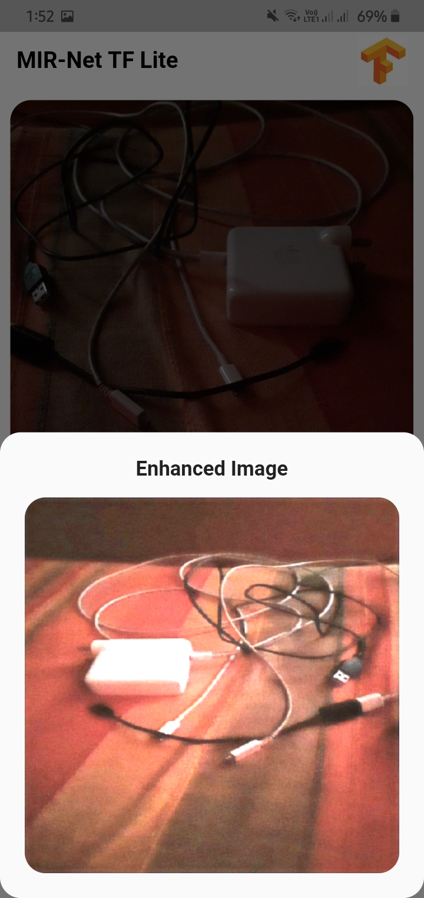
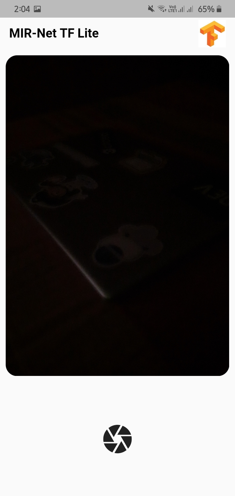
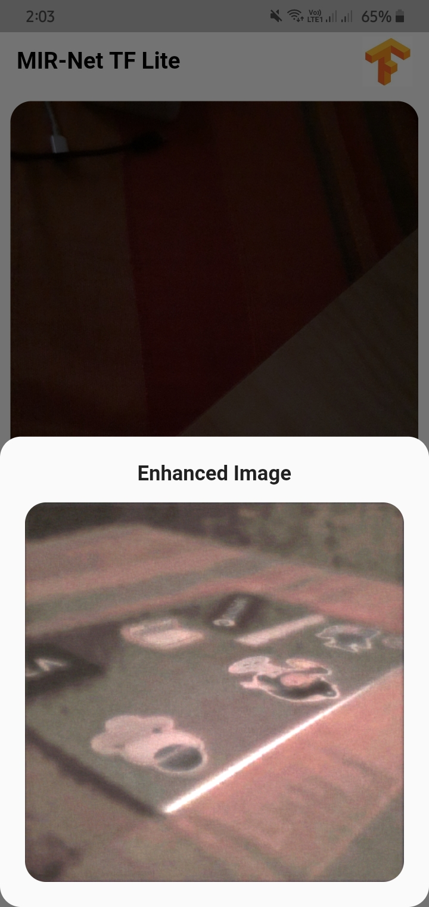

# MIRNet Flutter

#### MIRNet model is used to enhance a low-light image. Implemented MIRNet TF-Lite Model with Flutter App.

## Description

This flutter app is used to enhance low light images.

## TF-Hub
>https://tfhub.dev/sayakpaul/lite-model/mirnet-fixed/dr/1<br>
>Used TFLite (mirnet-fixed/integer)

> My Repo: https://github.com/sayannath/Low-Light-Image-Enhancement

## Screenshots
<p>
    <br>
    
    
    
    
</p>

## Project Structure
```
.
├── main.dart
├── services
│   └── transfer.dart
└── views
    └── tansferPage.dart

2 directories, 3 files
```
## Reference Taken
Reference Paper: https://arxiv.org/pdf/2003.06792v2.pdf<br>
Reference Repositry Link: https://github.com/soumik12345/MIRNet/<br>
Reference Repositry Link: https://github.com/sayakpaul/MIRNet-TFLite-TRT/

## Pull Request

Pull Requests are welcome. Please follow these rules for the ease of understanding:
* Make sure to check for available issues before raising one
* Give me a maximum of 24-48 hours to respond
* Have proper documentation on the parts you are changing/adding

## Developed & Maintained by

[👨 Sayan Nath](https://sayan-nath.web.app/)
[📷 Insta](https://www.instagram.com/sayannath235/)
[🐤 Twitter](https://twitter.com/SayanNa20204009)
[🧳 LinkedIn](https://www.linkedin.com/in/sayan-nath-15a989182/)

[](https://github.com/sayannath)
